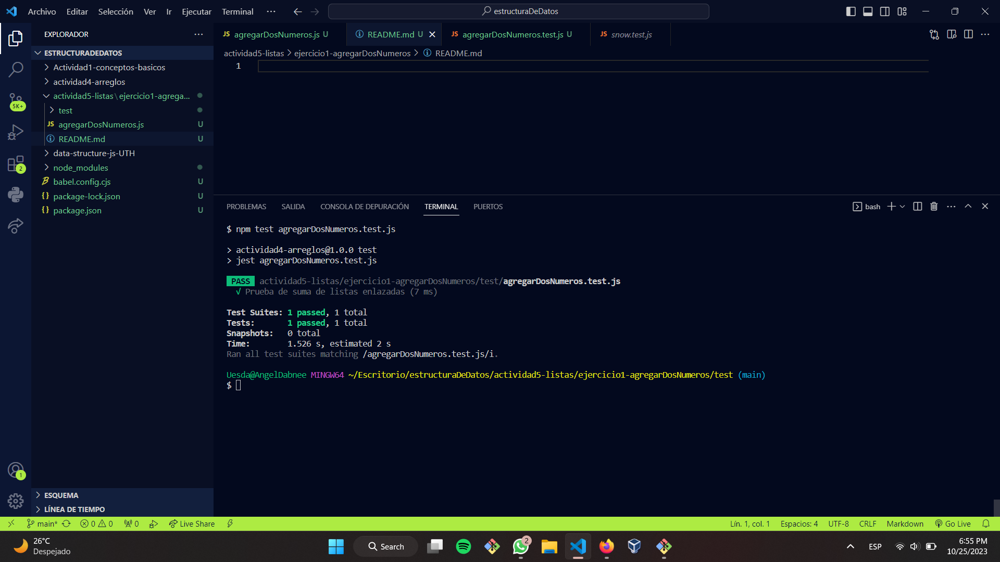

#¿Qué es una Lista? 
Las listas no son arreglos (arrays), aunque ambos representan secuencias de elementos de un tipo, los arreglos tienen longitud fija; las listas, no; es decir, las listas son flexibles y permiten cambio de implementación.
En una lista enlazada, cada elemento apunta al siguiente excepto el último que no tiene sucesor y el valor del enlace es null. Por ello los elementos son registros que contienen el dato a almacenar y un enlace al siguiente elemento. Los elementos de una lista, suelen recibir también el nombre de Nodos de la lista. 

