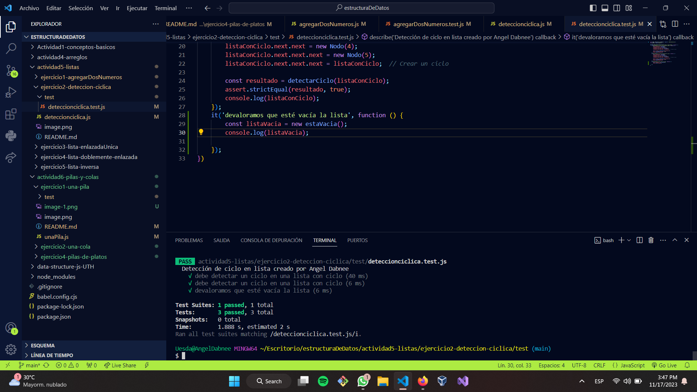

#Detección Ciclica. 

En la teoría de gráficos, un ciclo en un gráfico es un rastro no vacío en el que sólo los primeros y últimos vértices son iguales. Un ciclo dirigido en un gráfico dirigido es un no vacío en el que sólo los primeros y últimos vértices son iguales.

#Valoramos además que la lista esté vacía. 
