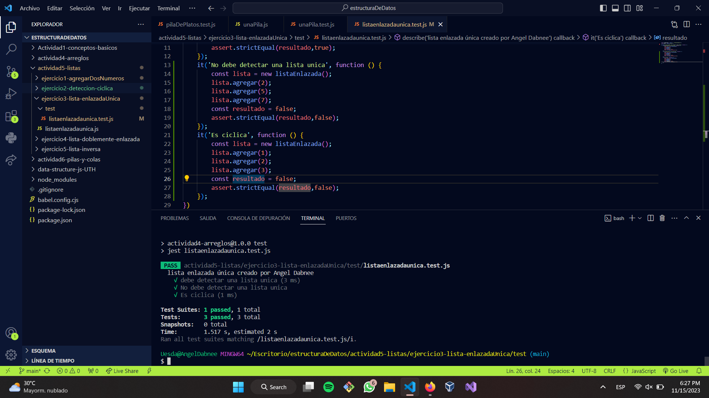

#Lista Enlazada Única. 
Una lista enlazada es una estructura de datos lineal similar a un arreglo. Sin embargo, a diferencia de los arreglos, los elementos no son almacenados en una ubicación de la memoria o índice en particular. Más bien, cada elemento es un objeto separado que contiene un puntero/apuntador o enlace al siguiente objeto en esa lista.
##Además
Una lista enlazada es una de las estructuras de datos fundamentales, y puede ser usada para implementar otras estructuras de datos. Consiste en una secuencia de nodos, en los que se guardan campos de datos arbitrarios y una o dos referencias, enlaces o punteros al nodo anterior o posterior

