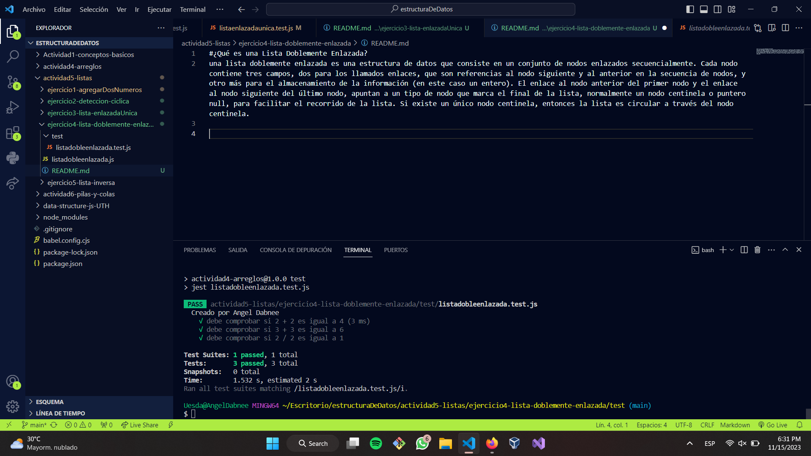

#¿Qué es una Lista Doblemente Enlazada? 
una lista doblemente enlazada es una estructura de datos que consiste en un conjunto de nodos enlazados secuencialmente. Cada nodo contiene tres campos, dos para los llamados enlaces, que son referencias al nodo siguiente y al anterior en la secuencia de nodos, y otro más para el almacenamiento de la información (en este caso un entero). El enlace al nodo anterior del primer nodo y el enlace al nodo siguiente del último nodo, apuntan a un tipo de nodo que marca el final de la lista, normalmente un nodo centinela o puntero null, para facilitar el recorrido de la lista. Si existe un único nodo centinela, entonces la lista es circular a través del nodo centinela. 

