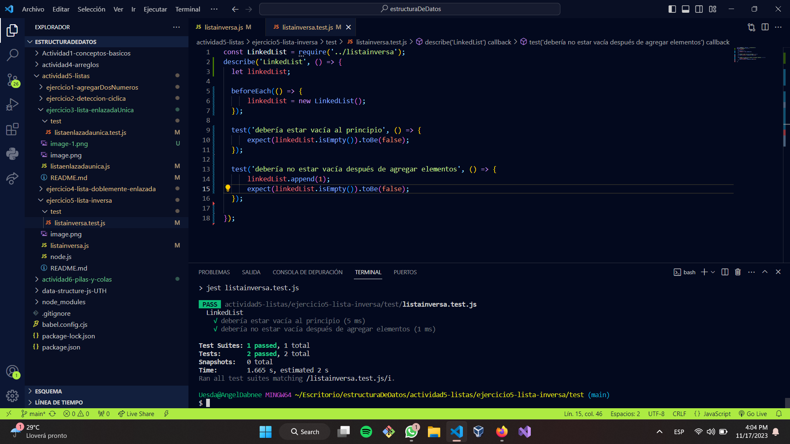

#Lista Inversa. 
El método reverse() invierte el orden de los elementos de un array in place. El primer elemento pasa a ser el último y el último pasa a ser el primero.

#Descripción

El método reverse cruza los elementos del objeto matriz invocados en su lugar, mutando la matriz, y retornando una referencia a la misma.

#ejemplos
const a = [1, 2, 3];

console.log(a); // [1, 2, 3]

a.reverse();

console.log(a); // [3, 2, 1]

