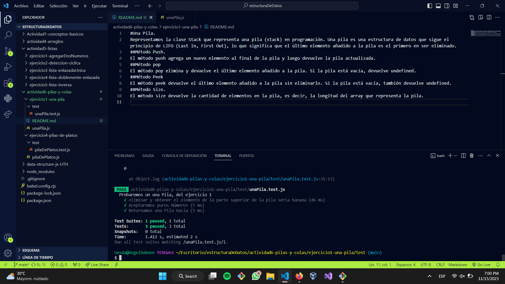

#Una Pila. 
Representamos la clase Stack que representa una pila (stack) en programación. Una pila es una estructura de datos que sigue el principio de LIFO (Last In, First Out), lo que significa que el último elemento añadido a la pila es el primero en ser eliminado.
##Método Push. 
El método push agrega un nuevo elemento al final de la pila y luego devuelve la pila actualizada.
##Método pop
El método pop elimina y devuelve el último elemento añadido a la pila. Si la pila está vacía, devuelve undefined.
##Método Peek
El método peek devuelve el último elemento añadido a la pila sin eliminarlo. Si la pila está vacía, también devuelve undefined.
##Método Size. 
El método size devuelve la cantidad de elementos en la pila, es decir, la longitud del array que representa la pila.

