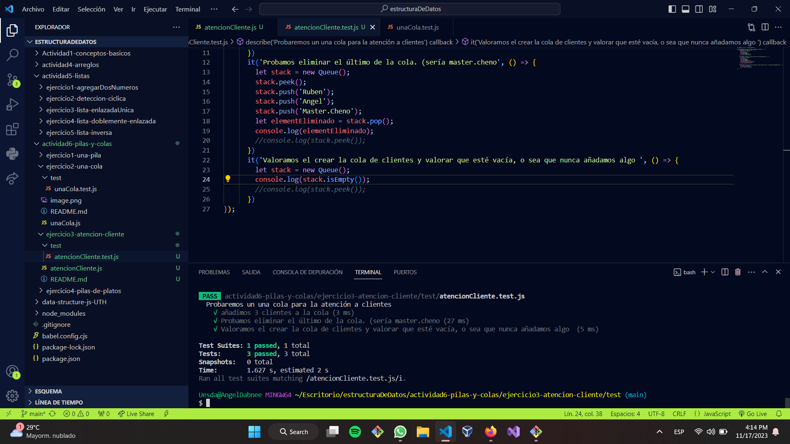

 simula un sistema de atención al cliente donde los clientes llegan y se agregan a una cola. Luego, los clientes se atienden en el mismo orden en que llegaron, utilizando el principio de "primero en entrar, primero en salir" (FIFO) de las colas. El bucle continuará hasta que la cola esté vacía, es decir, hasta que hayamos atendido a todos los clientes en orden de llegada.
 