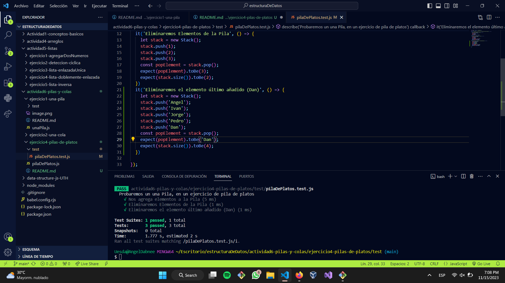

#Ejercicio de Pilas de Platos. 
##¿En qué consiste? 
Consiste en imaginarnos que añadimos un plato, más otro más otro, en donde el primer plato que añadimos pasa a ser el último, y el último añadido pasa a ser el primero que añadiremos, entonces tratamos de trabajar con esto. 

#