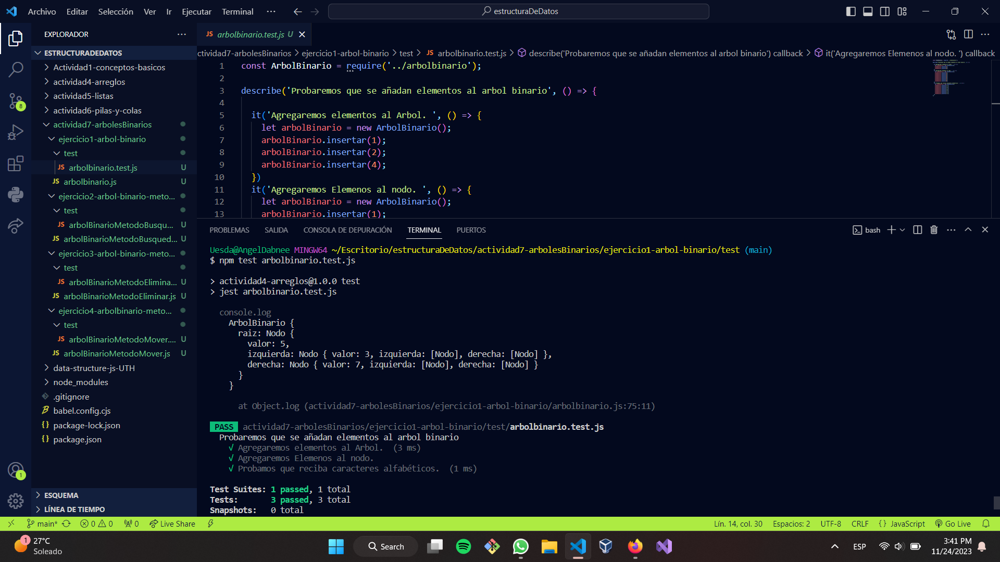

#Arboles Binarios. 
Teoría general de Arboles binarios

Los árboles a diferencia de las listas son una estructura de datos de no lineal, atendiendo más a una estructura de tipo jerárquico. Los árboles son, sin duda, una de las estructuras de datos no lineales, empleadas en informática, tanto para resolver problemas de hardware como de software. Los árboles de directorios son organizaciones bastante empleadas por cualquier usuario o programador de una computadora. De igual manera cumplen un buen papel en la toma de decisiones, valido como árbol de decisiones.

##Definición de árboles

Los árboles binarios son estructuras de datos muy similares a las listas doblemente enlazadas, en el sentido que tienen dos punteros que apuntan a otros elementos, pero no tienen una estructura lógica de tipo lineal o secuencial como aquellas, sino ramificada.  Tienen aspecto de árbol, de ahí su nombre.

