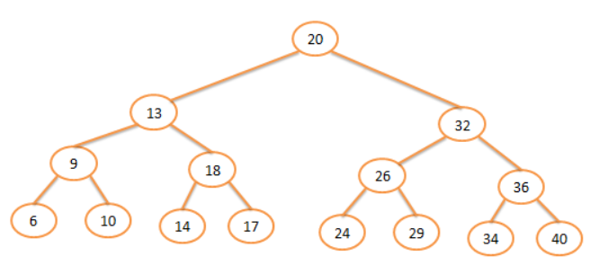

#Árbol binario de búsqueda (ABB)

Los árboles binarios de búsqueda, son un tipo especial de árbol binario cuya característica radica en la forma ordenada de insertar sus elementos, facilitando así la búsqueda de un nodo en particular. Para puntualizar aun más, se tratarán los árboles binarios de búsqueda, en los que se tiene preestablecido un cierto orden, que seguramente ayudará a encontrar un cierto dato dentro de un árbol con mucha rapidez.

Un ejemplo sería la forma más sencilla de explicarlo y comprenderlo.  Parimos de la siguiente gráfica del árbol binario de Búsqueda.

##La búsqueda en un árbol binario de búsqueda consiste en acceder a la raíz del árbol, si el elemento a localizar coincide con este la búsqueda ha concluido con éxito, si el elemento es menor se busca en el subárbol izquierdo y si es mayor en el derecho.

