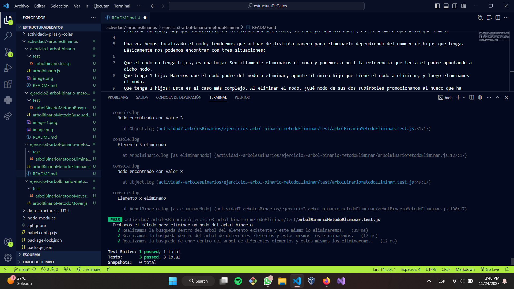

#Eliminación de un nodo

Esta es la operación más complicada de las tres que estamos viendo para los árboles binarios de búsqueda. En primer lugar, para eliminar un nodo, hay que localizarlo en la estructura del árbol, lo cual ya sabemos hacer, es la primera operación que vimos.

Una vez hemos localizado el nodo, tendremos que actuar de distinta manera para eliminarlo dependiendo del número de hijos que tenga. Básicamente nos podemos encontrar con tres situaciones:

Que el nodo no tenga hijos, es una hoja: Sencillamente eliminamos el nodo y ponemos a null la referencia que tenía el padre apuntando a dicho nodo.
Que tenga 1 hijo: Haremos que el nodo padre del nodo a eliminar, apunte al único hijo que tiene el nodo a eliminar, y luego eliminamos el nodo.
Que tenga 2 hijos: Este es el caso más complejo. Al eliminar el nodo, ¿Qué nodo de sus dos subárboles promocionamos al hueco que ha dejado el nodo eliminado? . Pues bien, tenemos dos opciones:

Seleccionar del subárbol izquierdo el nodo que ocupara el sitio del nodo eliminado. Buscaríamos el nodo de mayor valor de todo el subárbol izquierdo, que debe ser el que se encuentre más a la derecha.
Seleccionar del subárbol derecho el nodo que ocupara el sitio del nodo eliminado. Buscaríamos el nodo de menor valor de todo el subárbol derecho, que debe ser el que se encuentre mas a la izquierda

