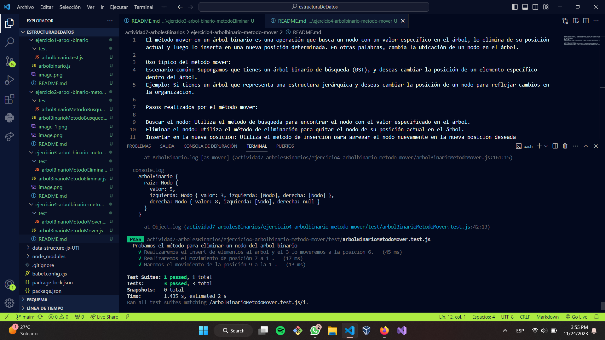

El método mover en un árbol binario es una operación que busca un nodo con un valor específico en el árbol, lo elimina de su posición actual y luego lo inserta en una nueva posición determinada. En otras palabras, cambia la ubicación de un nodo en el árbol.

Uso típico del método mover:
Escenario común: Supongamos que tienes un árbol binario de búsqueda (BST), y deseas cambiar la posición de un elemento específico dentro del árbol.
Ejemplo: Si tienes un árbol que representa una estructura jerárquica y deseas cambiar la posición de un nodo para reflejar cambios en la organización.

Pasos realizados por el método mover:

Buscar el nodo: Utiliza el método de búsqueda para encontrar el nodo con el valor especificado en el árbol.
Eliminar el nodo: Utiliza el método de eliminación para quitar el nodo de su posición actual en el árbol.
Insertar en la nueva posición: Utiliza el método de inserción para agregar el nodo nuevamente en la nueva posición deseada
